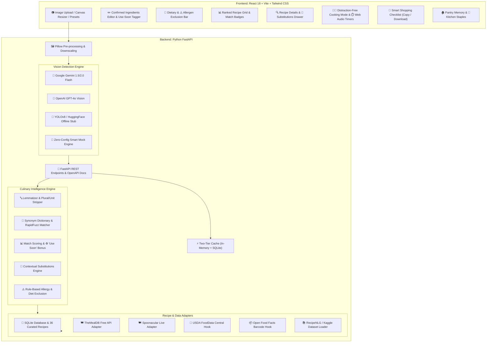

# 🍳 FridgeChef AI: Multimodal Recipe Generator from Fridge Photos

> **Hackathon Edition** — Turn open fridge photos into delicious, zero-waste dinners with AI vision, match-percentage ranking, culinary substitutions, and step-by-step cooking timers.

---

## 🌟 Problem & Objective

Almost everyone has stood in front of an open fridge wondering what to cook while produce and leftovers quietly go bad. Traditional recipe platforms ask you to buy what's missing rather than starting from what you actually have.

**FridgeChef AI** solves this by:
1. Identifying visible ingredients from fridge and pantry photos using Multimodal Vision AI.
2. Enabling an immediate confirm-and-edit step (renaming, deleting, and marking perishable items as **`♻️ Use Soon`**).
3. Ranking recipes by how many ingredients you own with an **Expiry-Aware Priority Bonus** to minimize food waste.
4. Supplying practical, tested culinary substitutions for whatever is missing.
5. Enforcing rule-based dietary filters (**Vegan, Vegetarian, Keto, Gluten-Free**) and hard allergen exclusions.
6. Providing a clean, distraction-free **Step-by-Step Cooking Mode** with built-in interactive countdown timers and audio chime alerts.
7. Generating a consolidated, downloadable **Shopping Checklist** for missing items across chosen recipes.

---

## 📐 Architecture Overview



---
graph TD
    User Photo/Input --> |Uploads Image| VisionEngine[Vision Detection Engine]
    VisionEngine --> |Gemini / GPT-4o / Fallback| ConfirmedItems[Confirmed Ingredients Editor]
    ConfirmedItems --> |Tag Expiry| ExpiryBoost[Use Soon Priority Bonus]
    ConfirmedItems --> |Apply Preferences| RulesEngine[Dietary & Allergen Filters]
    
    RulesEngine --> |Filtered Items| MatchingEngine[Matching & Ranking Engine]
    MatchingEngine --> |Fuzzy Match / Normalizer| DB[(Recipes DB & APIs)]
    
    DB --> |Ranked Results| UI[Frontend UI]
    UI --> |Missing Items| Subs[Substitution Engine]
    UI --> |Cooking Step| CookingMode[Interactive Step Cooking Mode]
    UI --> |Export| ShoppingList[Smart Shopping List]
## 🚀 Features Checklist

- [x] 📷 **Fridge/Pantry Photo Upload**: Drag-and-drop, file picker, and camera capture simulation.
- [x] ✍️ **Manual Ingredient Entry**: Quick chip input or comma-separated batch pasting.
- [x] 🤖 **AI/Vision Ingredient Detection**: Multimodal LLM (Gemini / OpenAI) with automatic fallback to high-accuracy offline smart mock.
- [x] ✏️ **Edit, Rename, Add, & Delete**: Full confirm-and-edit workflow with category badges and confidence indicators.
- [x] 🍳 **Recipe Generation & Retrieval**: 36+ curated authentic recipes + live TheMealDB & Spoonacular integrations.
- [x] 📊 **Ingredient Match Scoring & Ranking**: Percentages computed using owned items and pantry staples.
- [x] 🔄 **Culinary Substitutions**: 50+ tested cooking swaps with pantry-awareness.
- [x] 🥬 **Vegan**: Strict exclusion of all animal products.
- [x] 🥗 **Vegetarian**: Exclusion of meat, poultry, seafood, and gelatin.
- [x] 🥑 **Keto**: Net-carbs threshold ($\le 15$g/serving) and keto-tagged recipes.
- [x] 🌾 **Gluten-Free**: Strict wheat/gluten exclusion.
- [x] ⚠️ **Allergy Exclusion**: Rule-based exclusion for Peanuts, Tree Nuts, Dairy, Eggs, Soy, Shellfish, Fish, Wheat, and Sesame.
- [x] 🛒 **Shopping-List Generation**: One-click missing item rollup, checkbox tracking, clipboard copy, and `.txt` file download.
- [x] ♻️ **Expiry / "Use Soon" Concept**: Marking perishable items boosts recipe ranking score by $+15\%$ per expiring item to eliminate food waste.
- [x] ⭐ **Saved Favorites**: Bookmarking stored in SQLite.
- [x] 🏠 **Pantry Memory**: Persistent items stored across sessions.
- [x] 🧂 **Pantry Staples**: Toggleable kitchen basics (salt, pepper, olive oil, flour, garlic, etc.).
- [x] 🥗 **Nutrition Summary**: Calories, protein, carbs, fat, and fiber per serving with visual macro cards.
- [x] 👨🍳 **Step-by-Step Cooking Mode**: Clean, high-contrast, large-text counter view with keyboard navigation.
- [x] ⏱️ **Cooking Timers**: Interactive countdown timers with pause/reset and Web Audio chime alerts.
- [x] 🔤 **Ingredient Normalization**: Measurement stripping, plural reduction, and lemmatization.
- [x] 🔎 **Synonym & Fuzzy Matching**: Canonical dictionary mapping + RapidFuzz token sort matching.
- [x] 💾 **SQLite Architecture Boundary**: Repositories for pantry items, staples, favorites, shopping list, and query cache.
- [x] ⚡ **Caching**: Multi-tiered in-memory and SQLite caching to eliminate duplicate API calls.
- [x] 🖼️ **Image Resizing**: Canvas client-side compression + Pillow downscaling.
- [x] 🛟 **Mock-Data Fallback**: 100% functional out-of-the-box with zero API keys required.
- [x] 📡 **FastAPI Backend Architecture**: Modular router, services, schemas, and auto-generated Swagger UI at `/docs`.
- [x] 🧠 **Multimodal LLM Architecture**: Gemini 1.5/2.0 Flash & OpenAI GPT-4o compatibility.
- [x] 🧩 **YOLO/Hugging Face Offline Stub**: Edge AI object detection pipeline architecture.
- [x] 🍽️ **Spoonacular / TheMealDB Integration Points**: Live adapters for cloud recipe lookup.
- [x] 🥦 **USDA FoodData Central Integration Point**: Macro and micronutrient lookup service.
- [x] 📦 **Open Food Facts Extension Point**: Barcode product and allergen lookup.
- [x] 📚 **RecipeNLG/Kaggle Dataset Option**: Data ingestion pipeline for open recipe datasets.
- [x] ☁️ **Vercel/Netlify + Render/Railway Deployment**: Preconfigured `render.yaml`, `Procfile`, `Dockerfile`, `vercel.json`, `netlify.toml`.
- [x] 🎬 **Complete Hackathon Demo Flow**: 1-click guided demo tour banner guiding judges through the 6 core pitch milestones!

---

## 🎬 2-Minute Hackathon Demo Pitch Script

Follow the interactive **"Guided Demo Tour"** banner at the top of the app to demonstrate the complete pitch:

1. **Step 1: Photo Ingest**
   - Click the preset button **"Family Fridge"** (or drag in your own photo).
   - *Pitch point:* "Our vision engine identifies visible produce, dairy, and proteins in seconds with automatic image downscaling."
2. **Step 2: Confirm & Edit (Human-in-the-loop)**
   - Click to rename an item or add a manual ingredient.
   - Click **`♻️ Use Soon`** on `baby spinach`.
   - *Pitch point:* "Vision is never perfect, so users can edit any item. Tagging spinach as 'Use Soon' signals to our engine that it's going bad."
3. **Step 3: Safety & Dietary Filters**
   - Toggle **Gluten-Free** or exclude **Peanuts**.
   - *Pitch point:* "We use deterministic, rule-based ingredient blacklists—not unpredictable LLM hallucinations—for allergen safety."
4. **Step 4: Match Ranking & Substitutions**
   - Notice how recipes are ranked with high match percentages (e.g. `83% Match`), and the spinach recipe displays the glowing badge: `♻️ Uses 1 expiring item!`.
   - Click "View Details" on an item missing sour cream to reveal the **Substitutions Drawer** (e.g., plain greek yogurt).
   - *Pitch point:* "Users never hit a dead end if an ingredient is missing."
5. **Step 5: Hands-Free Cooking Mode**
   - Click **Start Step-by-Step Cooking Mode**.
   - Show the large-font counter display and start the interactive **Step Timer** with Web Audio sound alert.
6. **Step 6: Smart Shopping List**
   - Click **Add all missing to list**, open the shopping checklist, check off items, and click **Copy** or **Download as .txt**.
   - *Pitch point:* "From 'What's in my fridge?' to 'Dinner is served and here is exactly what to buy next time'."

---

## 🛠️ Quick Local Setup

### 1. Run Backend (FastAPI)
```powershell
# From project root:
cd backend
python -m pip install -r requirements.txt
python -m uvicorn main:app --reload --port 8000
```
API Documentation will be live at: **http://127.0.0.1:8000/docs**

### 2. Run Frontend (React + Vite)
```powershell
# In a separate terminal:
cd frontend
npm install
npm run dev
```
Frontend Web UI will be live at: **http://localhost:5173**

*(Or simply double-click `run_dev.bat` on Windows!)*

---

## 🧪 Automated Testing

Run the comprehensive unit test suite:
```powershell
python backend/tests/test_engine.py
```
Validates:
- Normalizer (plurals, measurement units, synonyms)
- Fuzzy matching & RapidFuzz token sort
- Allergen rule-based exclusion
- Expiry-aware ranking boost
- Contextual culinary substitutions
- SQLite database persistence

git clone https://github.com/Venkatesh-Web-dev01/fridge-chef_03.git
cd fridge-chef_03


git add README.md
git commit -m "Update README.md"
git push origin main`     

